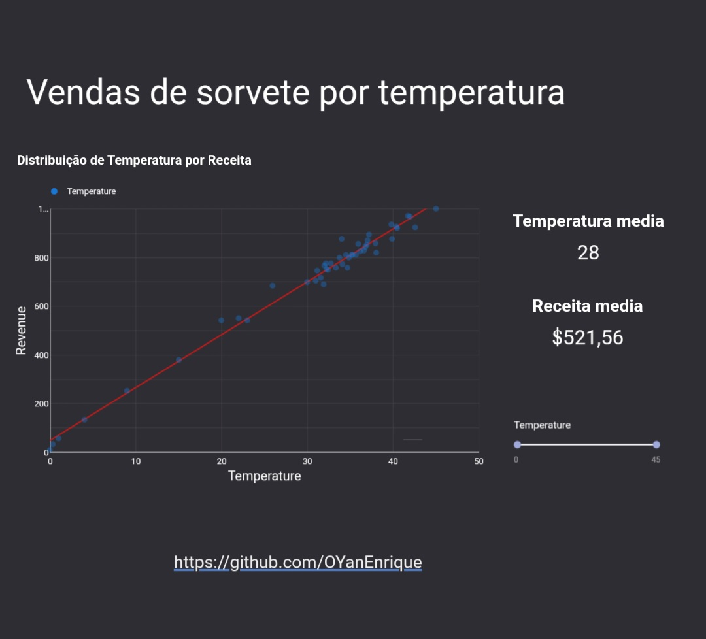
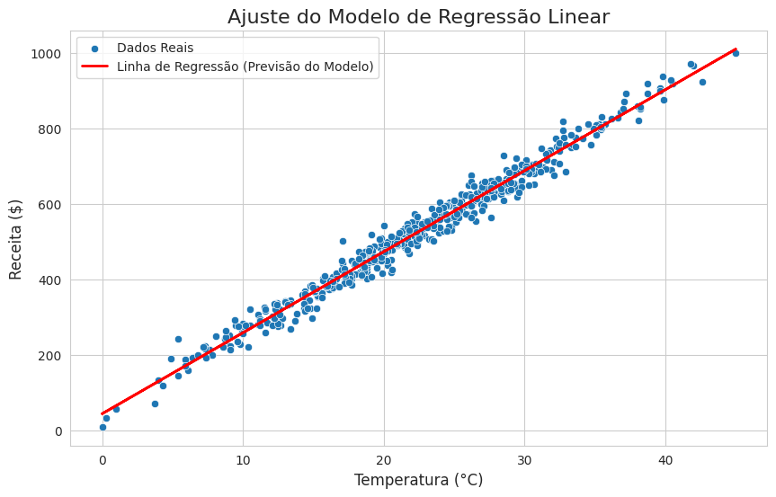

[Read in portuguese](README.pt.md)

# 🍦 When the Sun Rises, Sales Soar: A Predictive Analysis

We all know it by intuition: hot days and ice cream are a perfect match. But what if we could go beyond intuition? What if we could use data to create a true "crystal ball" capable of predicting exactly how much an ice cream shop's revenue could increase with every degree the temperature rises?

This project does just that. We dove into a sales dataset to turn common sense into a precise mathematical model. Using **Linear Regression**, we deciphered the relationship between temperature and revenue, creating a tool to forecast sales success before the sun even hits its peak.

[](https://lookerstudio.google.com/reporting/312a8405-a3f1-4d25-ba32-d7b3fb73eee7/page/WYKUF)

---

## 🔮 The Interactive Oracle: Explore the Data

To make this analysis accessible to everyone, we built a visual oracle in **Looker Studio**. On this interactive dashboard, you can adjust the temperature with a slider and watch the revenue forecast respond in real-time. It's not just a chart; it's your chance to predict the future of sales.

**[>> Consult the Interactive Oracle Here <<](https://lookerstudio.google.com/reporting/312a8405-a3f1-4d25-ba32-d7b3fb73eee7/page/WYKUF)**



---

## 📈 The Revelation: The Magic Formula for Sales

Our analysis confirmed what we suspected: there is a strong, clear linear connection between temperature and revenue. Using the **Scikit-learn** library, we taught a model to "learn" this relationship and translate it into a powerful predictive formula.

### The Prophecy's Equation

The model revealed the following equation to predict revenue:

$$ \text{Revenue} = 21.44 \times \text{Temperature} + 44.27 $$

-   **Coefficient (m):** `21.44`
-   **Intercept (c):** `44.27`

**What does this mean?** The revelation is simple and powerful: the model predicts that for every **1°C increase in temperature**, the ice cream shop's revenue is expected to **increase by approximately $21.44**.

### Testing the Prophecy
To validate our model, we made a prediction:
* For a day with a temperature of **25°C**, the predicted revenue is **$580.31**.

### Visualizing the Connection
The scatter plot below leaves no doubt. The red line, representing our model's predictions, fits the real-world data perfectly, visually confirming the strong positive correlation.



---

## 📜 The Ancient Scrolls: The Dataset

Our journey wouldn't have been possible without the manuscripts containing the secrets of past sales. We used the "Ice Cream Sales Dataset," originally sourced from Kaggle.

* **Original Source:** [Ice Cream Sales Dataset on Kaggle](https://www.kaggle.com/datasets/sakshisatre/ice-cream-sales-dataset)
* **Author:** Sakshi Satre

The `df_final_ice_cream.csv` file in this repository is the cleaned and prepared version, containing the two columns essential for our magic: `Temperature` (°C) and `Revenue` ($).

---

## 🛠️ The Alchemist's Cauldron: Tools & Libraries

To turn raw data into predictive gold, we used the following tools:

* **Language:** Python
* **Magic Libraries:**
    * Pandas (for organizing and manipulating data)
    * Matplotlib & Seaborn (for visualizations and charts)
    * Scikit-learn (for conjuring the Linear Regression model)
* **Spellcasting Environment:** Jupyter Notebook
* **BI Tool:** Looker Studio (for our interactive oracle)

---

## 🚀 Recreate the Magic: How to Run the Project

Follow these steps to run the analysis and make your own predictions:

1.  **Clone the repository:**
    ```bash
    git clone [https://github.com/OYanEnrique/ice-cream-revenue-prediction.git](https://github.com/OYanEnrique/ice-cream-revenue-prediction.git)
    cd ice-cream-revenue-prediction
    ```
2.  **Install the necessary ingredients:**
    ```bash
    pip install pandas matplotlib seaborn scikit-learn jupyterlab
    ```

3.  **Start the lab:**
    ```bash
    jupyter lab
    ```

4.  Open and run the `ice_cream_data.ipynb` notebook to witness the full analysis.

---

## 👨‍💻 O Arquiteto da Análise

* **Yan Enrique**
* **LinkedIn:** [https://www.linkedin.com/in/yanenrique/](https://www.linkedin.com/in/yanenrique/)
* **GitHub:** [https://github.com/OYanEnrique](https://github.com/OYanEnrique)
* **Landing page:** [https://yanenrique.carrd.co](https://yanenrique.carrd.co)
---
